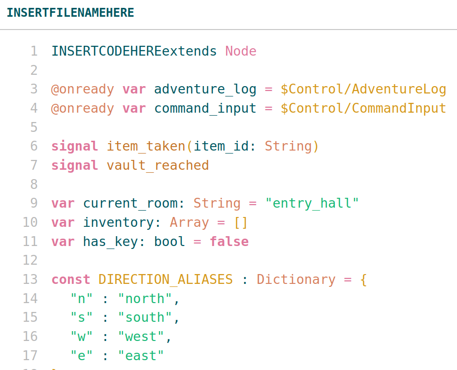

# GDScript Printer

Want to print your gdscript to a page so you can look at it later all-pretty-like? Realized in horror that the vscode print extensions don't support gdscript? Love the noctis lux color vibes on-screen and wanted them off-screen?

Well here's an HTML file for you!

## How it do

Just pop the HTML file open in a text editor, `CTRL+F` to find the placeholder lines, replace each with appropriate text, replace the code block itself with your own gdscript, save it, re-open it in a browser, and you'll probably get a thing you can print that looks cute!

The four placeholders to replace:

- `INSERTTITLEHERE` — the browser tab title
- `INSERTFILENAMEHERE` — the filename shown in the listing header
- `INSERTCODEHERE` — sits immediately before your code (replace this marker; your first code line follows)
- `INSERTLASTCODELINEISHERE` — sits immediately after your last code line

## It's broken, or things aren't as pretty as I wanted

The file was written by Anthropic's Claude, so you can just upload the entire HTML source code as a prompt to Claude and ask it to correct errors. I recommend uploading the chunk of actual gdscript that looks bad, as the LLM does a lot better with a real example when making changes. Remember to anonymize anything sensitive.

## Where does this beautiful color scheme come from

I tried to get the vibes of the colors of Liviu Schera's gorgeous [Noctis Lux](https://github.com/liviuschera/noctis/) color scheme. However, at least three reasons why this won't (and likely can't ever) match Noctis Lux:

1. Your printer and your monitor can't reproduce the same colors, for a variety of reasons, involving both technology and physics
2. The Noctis Lux color scheme has a creamy beige background which is omitted here to save ink, and our eyes perceive color based on context (see: the gold dress vs. blue dress debate that briefly consumed the world, or your nearest color theory textbook)
3. Even if you could by some fairy magic have popping tangerine on paper, reading brightly colored text on a monitor is pleasant whereas brightly colored text on paper often isn't

...so this is darker and more muted than the real deal. But obviously you can change any particular color to anything. The script was borne of me throwing a fit when I couldn't print directly from vscode using the Noctis theme itself, and given that I'm learning three different languages for the purposes of game design, learning a fourth just to print code was not high on my to-do list.

## Why upload this to the interwebs

I've been learning coding by printing out my own code and reading it later. You might find it useful for creating your own paper cookbook of snippets, or for sending as a PDF to students, who knows. I also saw one person on Reddit three years ago looking to do the same thing who got flamed for the audacity of wanting to print code. This one's for you, babe!

## License

MIT License all the way! See [`LICENSE`](LICENSE). Note that Liviu Schera's themes are also distributed under the MIT License; his GitHub is [@liviuschera](https://github.com/liviuschera/noctis/).
